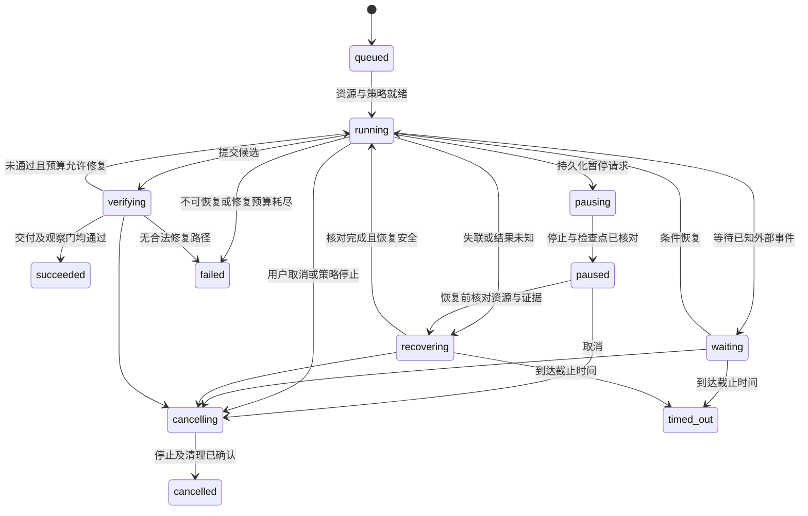

# Loopit 工作台执行与交付契约

版本：v0.3；配套[主规格](loopit-workbench-spec.md)。本文件定义将实现的协议与不变量；示例中的 ID、摘要和命令名是协议示意，不表示服务或脚本已经存在。按[单一开源底座决策](reference-and-selection.md#0-当前决策单一开源底座)，协议优先映射到底座已有对象与扩展点，不要求另建同名服务或多 Runtime 抽象。

## 1 目标契约

GoalSpec 是运行的根输入。用户自然语言可以由模型整理成结构化内容，但新增假设不得悄悄扩大目标或改写验收条件。尚缺必要信息的目标保持 draft；可以并行进行只读调查，正式交付 Run 在条件可判且能力满足后启动。

| 字段 | 必需内容 |
| --- | --- |
| identity | projectId、taskId、goalRevision、原始目标及其摘要 |
| scope | 仓库和基线、允许修改范围、输入材料引用、明确的不包含项 |
| acceptance | 每项独立 ID、预期行为、验证类型、证据要求、平台/环境、阈值或 rubric、requiredAtStage 与证据依赖 |
| delivery | 产物类型、渠道、环境、是否合并、部署和观察要求 |
| policyRef | 不可变策略版本：权限、工具、数据、部署、资源和失败处理 |
| budgets | 时间、模型用量/金额、修复次数、并行度、子任务共享预算 |
| resources | Worker 能力、设备矩阵、fixture 和密钥引用 |
| completion | 所有必需条目通过、观察窗口满足、无未核对副作用、资源释放完成 |

以下是首个业务目标可采用的形状，具体功能仍由用户确定：

```json
{
  "schemaVersion": "goal/1",
  "projectId": "loopit-mobile",
  "taskId": "feature-001",
  "goalRevision": 1,
  "objective": "在设置中提供可查看和复制非敏感版本及环境信息的诊断页",
  "scope": {
    "repositoryRef": "repo://loopit-mobile",
    "baseRevision": "<resolved-commit>",
    "allowedPaths": ["<confirmed-feature-scope>"],
    "excluded": ["修改登录方式", "公开商店发布"]
  },
  "acceptance": [
    {
      "id": "F1",
      "expected": "显示版本与构建标识，与设备安装事实一致",
      "verification": "executable",
      "evidenceKinds": ["installed-build-receipt", "ui-observation"]
    },
    {
      "id": "F2",
      "expected": "复制内容不含账号、token、设备持久标识",
      "verification": "executable",
      "evidenceKinds": ["clipboard-receipt", "privacy-check"]
    }
  ],
  "targetMatrix": [{"platform": "android", "deviceKind": "physical"}],
  "delivery": {
    "channelRef": "internal-test",
    "environmentRef": "test",
    "observationMinutes": 30
  },
  "policyRef": "policy://loopit-internal/v1",
  "budgets": {"wallMinutes": 120, "maxRepairCycles": 3, "maxParallelWriters": 1},
  "costBudgetRef": "budget://project-default/v1"
}
```

预算值是建议初始值。运行前 MUST 将所有引用解析为具体版本并验证，禁止带占位符提交运行。目标引用一个完整的授权及预算版本，避免把每次审批藏在模型对话中。

目标修订产生新 GoalRevision。若已有写入者执行旧 revision，应先安全停下或让已开始且无法取消的操作完成并核对，尚未结案的旧 revision 标为 superseded；已经成功、失败或取消的旧 revision 保持终态，只增加 successor 引用。新 revision 根据变化范围重验，不能继承不再匹配的成功结论或抹去原有失败。

## 2 统一产物与证据

### 2.1 ArtifactEnvelope

每项产物 MUST 具备：`artifactId、kind、schemaVersion、digest、size、mediaType、storageRef、projectId、taskId、goalRevision、runId、stageRunId、attemptId、producer、createdAt、inputDigests、sensitivity、retentionPolicy`。存储地址可以变化，digest 和产物身份不变；修改内容产生新产物。

Artifact 表示“存在一项产出”；Evidence 表示“这项产出如何证明某个条件”。Evidence 另外包含 `criterionIds、candidateDigest、buildDigest、environmentRevision、toolVersion、observedAt、observationWindow、result、limitations`。设备证据还包含 platform、deviceKind、deviceIdRef、OS、installedBuildReceipt 和 fixtureRef。设备 ID 采用受控引用，不向普通界面暴露敏感标识。

构建身份不能只用 package name、bundle ID 或展示版本号表示。Candidate 绑定提交及未提交补丁摘要、依赖锁文件、构建参数；BuildReceipt 绑定二进制 digest、平台、签名身份引用和构建日志；InstallReceipt 由设备独立读取实际安装信息，并关联相同构建。热更新还需绑定实际加载的 JS bundle/OTA digest。

### 2.2 GateDecision

GateDecision 包含输入证据摘要集合、验收契约摘要、验证器版本与签名、每条结论、失败码、未覆盖项和最终 verdict。verdict 为 `passed / failed / blocked`。`not_applicable` 是经过合同允许的阶段 disposition，不是验收项的第四种通过方法。

Gate MUST 检查必需项完备、来源合法、版本匹配、窗口有效、未被撤回、评估器有权限。模型文本不能作为程序退出码、网络回执、安装身份或性能测量的替代品。没有观测到错误只在采集窗口与覆盖足够时支持“该窗口内未发现错误”。

GateDecision 明确 `scope=artifact|stage|delivery` 与 criterionIds。阶段 Gate 仅判断本阶段 requiredAtStage 的条目，未到执行阶段的条目保持 pending；最终 delivery Gate 汇总全部必需条目。测试阶段通过不要求未来的部署回执，部署通过不预支未来的观察结果。Plan 校验验收证据依赖无环，避免用最终交付条件阻止产生该条件所需的上游产物。

正式验证入口、判定规则、固定样本与回执签发身份放在 Builder 不可写的控制边界，验证工作区只挂载冻结候选。仓库自身的测试和构建脚本在无发布凭据的隔离环境运行，它们的自报结果属于辅助证据，不能单独签发最终 GateDecision。受测代码不得写入证据库的正式命名空间或冒充设备/构建代理；基础层以执行身份和产物摘要签发回执。

正式证据提交必须先完成原始产物写入与摘要校验，再在数据库记录引用并放行。原始录制失败或本地 ledger 丢失不得因为模型有摘要就通过。不能要求每个底层工具自己具备数据库事务，但交付证据入口必须提供持久提交回执。

## 3 六个环节的输入输出

| 环节 | 固定输入 | 固定输出 | 机器放行规则 | 合法短路 |
| --- | --- | --- | --- | --- |
| 需求 | GoalSpec、项目上下文、已有资料、策略 | RequirementSpec：目标映射、验收 ID、假设、依赖、范围、平台矩阵 | 用户目标未被改写；每项必需验收有可执行方法或固定 rubric；依赖和预算可解析 | 复用匹配 GoalRevision 的 RequirementSpec；不可省去目标及验收存在性检查 |
| UI/设计 | RequirementSpec、现有 UI、设计系统、可用设计输入 | DesignSpec：状态、交互、空/错/加载场景、无障碍、资源/token/视觉基线；或 NoDesignChange | 所有受影响的 UI 条目有设计依据；资源可读；接口和交互约束一致 | 无 UI 变化或已有设计完全匹配；留下 not_applicable/reused 回执 |
| 开发 | 需求与设计输出、基线候选、计划、工具能力、策略 | CandidateManifest、代码或内容 diff、变更说明、快速检查报告 | 修改范围合法；产物可解析；基线清楚；快速检查通过；候选冻结 | 对只读任务不适用；对已有候选按摘要复用 |
| 测试/验证 | 冻结候选、验收契约、测试计划、fixture、设备与构建能力 | VerificationReport、每条 Evidence、模型 Assessment、GateDecision、缺口 | 本阶段必需条目通过；独立执行与来源符合要求；本阶段无未知结果 | 只有完全匹配的候选、依赖、环境、验证器和有效窗口可复用；不能仅因已有绿灯跳过 |
| 打包部署 | 已验证候选、BuildSpec、目标环境、发布策略、回滚方案 | ReleaseManifest、签名构建、分发/部署回执、最终包验证、回滚引用 | 最终包可安装，所有适用的功能证据有效；变化影响不明时全量重验；发布回执可核对 | 已有包可复用构建；只读报告不需要打包；仅交付补丁时部署不适用 |
| 运维 | DeploymentReceipt、观察策略、环境、指标源、基线 | ObservationReport、告警/修复/回滚事件、DeliveryReport | 规定窗口与最小样本满足；健康阈值满足；必需数据源可查；清理完成 | 无部署的任务产生 NoRuntimeChange；不能用无流量代替已部署功能的健康观察 |

每个阶段输出通用 `StageResult`：`status、inputRefs、outputRefs、attempts、checks、failure、disposition、nextProposal、timing、usage`。阶段执行器不得直接推进下游状态，只提交结果与建议；编排层依据协议推进。

需求中的技术拆解、设计、实现方案由模型完成，不增加人工 Spec 审批。若发现验收标准本身矛盾或必须改变目标，提交 ConstraintRequest 给用户制定新标准，而不是让人操作流水线。

### 3.1 计划与依赖

Plan 包含版本、stage nodes、required inputs、输出类型、依赖边、拟用 Runtime/能力、资源需求和预算分配。编排检查 DAG 无环、上游产物类型匹配、策略允许、预算守恒；模型负责设计步骤内容和必要性。

修复可以退回开发、设计或需求调查；只有用户的目标变更才能改变 GoalRevision。无关产物按依赖摘要继续复用；受影响证据失效。正式验证冻结工作副本，Builder 的后续写入必须形成新 Candidate，不能污染正在验证的候选。

### 3.2 短路记录

StageDisposition 至少包括 `stageId、mode=reused|not_applicable、reason、ruleRef、inputDigests、reusedArtifactRefs、validatedBy、validatedAt`。短路只改变执行路径，不消除终点验收义务。

紧急回滚可以直接使用既有 ReleaseManifest 进入部署与观察，但必须确认它属于允许的环境、仍可恢复数据兼容性，并核对回滚实际生效。移动 App 回滚按渠道能力执行：内部渠道可重新分发兼容包，已安装公开版本不能假设可自动降级；可用功能开关、OTA（适用时）或停止扩量策略必须事先明确。

## 4 状态与循环

### 4.1 Task 与 Run

Task 以当前 GoalRevision 展示 `draft / ready / active / paused / blocked / succeeded / failed / cancelled / superseded`。历史 revision 保留独立状态。Run 为 `queued / running / waiting / recovering / verifying / pausing / paused / cancelling / succeeded / failed / cancelled / timed_out`。

StageRun 为 `pending / ready / running / paused / passed / failed / blocked / reused / not_applicable / cancelled`。Attempt 每次重试新建，状态独立。阶段 failed 可以被新 Attempt 修复，旧失败记录不改写。Task 只有在全部必需 Gate 与运维窗口完成后才 succeeded。



图表示主路径。任何非终态都有 deadline；到期先撤销新操作权限并核对已启动副作用，Run 可记录 timed_out，但 Task/资源必须保留 `unresolvedOperations` 和隔离状态，不能因运行超时而释放仍被旧进程控制的设备。取消同理：未证明实际停止时保持 cancelling，截止后记录失败原因和资源隔离，不谎报 cancelled。

pauseRun 对 queued、running、waiting、recovering、verifying 均有效。接受后停止派发新动作，核对或收敛已开始的副作用，保存 checkpoint 或可重建 ContextManifest，再进入 paused；无法停止时保持 pausing 并报告原因。只有确认无活动控制者、网络和代理已恢复时才能释放设备租约，否则隔离资源。

暂停期间默认继续累计目标 wall-clock deadline 和任务龄，只停止主动计算；改变 deadline 必须产生可追溯的目标/预算修订。恢复先核对剩余预算、资源、候选及证据有效期，再继续同一 Run。Runtime 不支持原生暂停时，安全停止旧进程，将旧 Attempt 记录为 interrupted_for_pause，恢复创建新 Attempt/原生会话并从已有事实重建；这不算失败重试，也不保证保留 Runtime 私有内存。用户控制行为单独计数，用人工暂停帮助排障仍算执行介入。

### 4.2 错误与重试

| 错误类 | 行为 |
| --- | --- |
| 瞬时限流、确定未执行的网络失败 | 有退避、抖动和次数上限的机制重试；计入预算 |
| 测试或语义验收失败 | 模型读失败证据，提出修复或新诊断；新 Candidate 重新验证 |
| 工具能力缺失、fixture 缺失 | 尝试策略允许且验收等价的替代；不成立则 blocked |
| 外部动作结果未知 | reconcile；不得把超时简单当作失败重新执行 |
| 越权、非法 schema、失效 fencing token | 拒绝并记录，不以扩大权限重试 |
| 验收器异常 | 验收 blocked；启动独立维护任务，不把基础设施错误误判为产品失败 |
| 预算、deadline 耗尽 | 停止新工作，核对和清理，保留最后候选及失败报告 |

默认单操作最多 3 次瞬时故障尝试；单目标最多 3 轮修复。它们是初始配置，用户可通过项目标准调整。底层 Runtime 自带重试须计量并声明，上层不能无感叠乘重试。Provider 费用不能精确实时测量时预留安全余量，达到本地阈值停止新调用；第三方最终账单仍以回执核对，不承诺可撤回已发出的计费请求。

## 5 Runtime Adapter

建议的语义接口如下，具体编程语言接口在 M0 冻结：

```text
probe() -> RuntimeCapabilities
start(ExecutionSpec, operationId) -> ExecutionHandle
observe(handle, cursor) -> NormalizedEvent stream
sendInput(handle, input, expectedGeneration) -> InputReceipt
checkpoint(handle) -> CheckpointRef | Unsupported
cancel(handle, reason) -> CancellationRequested
inspect(handle) -> ObservedExecutionState
reconcile(handle, lastReceipt) -> RecoveryDecision
collect(handle) -> ExecutionResult + ArtifactRefs
dispose(handle) -> CleanupReceipt
```

能力声明包括：structuredEvents、images、tools/MCP、nativeResume、checkpoint、steer、cancelMode、processTreeControl、permissionModes、sandboxKinds、usageReporting、maxConcurrency。某项不支持必须为明确值；不能用 GUI 内部可用推定 SDK 已提供。

ExecutionSpec 固定 Runtime/模型版本、原生会话引用、工作目录、ContextManifest、工具能力、PolicyRef、预算和输出合同。归一化事件包含 `started、output_delta、tool_started、tool_finished、input_required、checkpoint、settled、exited、failed`；保留原生事件引用以免归一化丢失语义。

`settled` 表示执行器暂时不再继续，不等于业务成功；`exited` 表示进程退出，不等于子进程和外部作业都停止。两者与 GateDecision 分开。

Runtime 如请求审批，Policy Engine 根据已冻结的授权包自动允许或拒绝；需要超出目标权限的请求作为约束，不能默认弹窗要求人逐项点击。Runtime 无法非交互落实策略或可靠终止时，不得纳入 autonomous 能力集合。

## 6 工具、设备、构建与发布

ToolResult 至少包含 `toolCallId、operationId、requestDigest、outcome、observedState、artifactRefs、usage、errorCode、retryable、reconcileHint`。副作用分为 `read_only / idempotent_write / reconcile_required / irreversible`；工具的分级来自受控注册表，模型不能自行声明“无副作用”。

设备 Broker 持有独占租约，提供 open、inspect、snapshot、act、wait、install、lifecycle、network、evidence、close 的能力。UI action 绑定 snapshot revision 与语义目标；状态漂移、歧义和 App 切换要重新观察。不可简单重试输入、发送、支付等动作。具体产品页面、账号和通过标准保留在 Case Pack，通用 Runtime 不认识 Loopit 文案。

Panels 作为同一 Broker 的观察客户端接入。只读订阅也须明确资源开销；若需要改变设备、网络或抓包配置，必须申请同一租约。独立运行的旧面板只有在实测不存在控制冲突时才允许共用节点。

Build Adapter 接收不可变 Candidate 和 BuildSpec，输出二进制摘要及日志。Release Adapter 支持 `publish / inspect / reconcile / stopRollout / rollback` 的能力声明；发布身份与凭据在基础层。没有 inspect/reconcile 的渠道不能承担会被自动重试的发布动作。

签名过期、MFA、商店审核、操作系统解锁等外部限制必须在接入体检或运行状态中显式出现。自动执行验收的环境应预先提供可机读凭据与可自动操作的测试设备；执行中要求用户解锁或输验证码算人工介入，不能称为无人通过。

## 7 权威状态与外部副作用

### 7.1 事件与命令

EventEnvelope 包含 `eventId、aggregateId、aggregateVersion、eventType、schemaVersion、commandId、causationId、correlationId、occurredAt、recordedAt、actor、payloadRef`。聚合内 sequence 单调递增，客户端按它去重，不按客户端时间排序。

同一事务内提交事件、状态投影、命令回执、outbox；事务之后才推送订阅或派发工作。优先在所选单一开源底座的存储和调度机制内落实；不预设 Temporal 或另建任务数据库。调度历史负责恢复，业务 ledger 是 Task、Gate 与发布事实的权威。执行报告以相同 commandId 去重，不绕过业务状态规则写状态。

Workflow 只决定何时唤醒已登记的工作单元。模型产生的 Plan 或 Decision 是已落账的 Activity 输出；replay 复用输出，不重跑随机推理。任何工作流升级必须通过历史 replay 兼容检查。

### 7.2 Operation Ledger

每个逻辑外部动作保留 `operationId、idempotencyKey、requestDigest、ownerGeneration、state、providerReceipt、externalResourceRef、reconcileMethod、lastObservedAt`。

逻辑动作重试继续使用相同 operationId/幂等键；真正改变候选、参数或发布目标才创建新操作。状态为 `intent_recorded / dispatched / succeeded / failed / indeterminate / compensated`。先记录 intent，再执行，最后记录回执。

例如上传已成功但 Worker 在记录回执前崩溃：恢复时按操作 ID 或包摘要查询渠道；找到同一构建就补记回执，没有找到但无法证明未发生则保持 indeterminate。只有能证明未发生或渠道具备可靠幂等支持时才重发。[Temporal Activity 的官方语义](https://docs.temporal.io/activity-definition)

### 7.3 并发、停止与恢复

资源租约包含 owner、generation、deadline 和可验证身份。Broker 对每个命令校验 fencing token。对于不能理解 fencing token 的设备/主机，必须由受控代理串行转发；代理本身被隔离，旧进程的直连能力必须撤销，不能仅依赖数据库里的锁。

一个 Worker 失联后：停止给它分配新工作 → 查询本机 Supervisor 与外部作业 → 撤销旧权限 → 确认旧写入者已停止 → 获取新 generation → 恢复或建立新 Attempt。无法确认则隔离资源，不能把“心跳断了”当作“进程死了”。

### 7.4 从旧备份恢复

数据库恢复到旧时间点不同于进程重启。恢复实例先进入 recovery-only 模式，撤销旧 Worker 和发布代理的有效身份，以独立于被恢复数据库的授权服务签发新 recoveryEpoch。所有租约、回执和工具命令同时校验 epoch 与 generation；旧数据库中较小的 generation 不能重新让旧 token 生效。

不可逆或需核对的副作用，在 dispatch 前必须将 operationId、请求摘要、目标/候选引用及幂等键同步写入独立故障域的恢复日志，回执继续追加；恢复日志未持久化时不派发。恢复时重放数据库备份点之后的日志，并与渠道和 Supervisor 核对。日志缺口或外部状态无法确认时保持相关动作 indeterminate，禁止重新发布。业务查询数据可接受既定 RPO，副作用恢复日志必须对已派发操作提供 RPO=0 的证据，不能用过期业务快照证明“未执行”。

## 8 三端 API 与通知

| 接口 | 语义 |
| --- | --- |
| createTask / reviseGoal | 建立目标或新版本；命令去重、版本比较、返回持久回执 |
| startRun / pauseRun / cancelRun / resumeRun | 依策略转换状态；暂停有持久状态，resume 先核对旧执行和有效证据 |
| appendContext | 添加来源明确的材料；不能隐式修改目标标准 |
| getTask / getRun / listDeliveries | 查询权威投影及其版本和更新时间 |
| subscribeEvents(afterCursor) | 有序事件增量；游标过期则返回快照和新游标 |
| getArtifact | 按权限获取证据，敏感原始数据与普通预览分开 |
| getMetrics / getResourceHealth | 固定口径查询与下钻，不由模型临时生成统计结论 |

接口同时校验用户、项目、方法和资源权限，不能把“WebSocket 已登录”当作所有操作均已授权。Worker 使用独立机器身份，仅能读取已分配任务和所需凭据引用。互联网接入使用 TLS 和经认证的反向连接/受控网络，不能直接暴露未认证本机端口。

resumeRun 只恢复尚未终结且可恢复的 Run。failed、timed_out、cancelled 等终态保留原记录，用户重试或策略允许的后续执行须建立新 Run，并继续汇总到同一 GoalRevision 的成本和历史；已耗尽的目标总预算不能因新 Run 自动重置。

通知来自持久事件：完成、不可恢复失败、需要用户修订目标或标准。恢复和长等待默认合并通知；不按每个 token 推送。通知失败不影响任务事实，重试依 notificationId 去重。手机推送不携带凭据或敏感证据。

## 9 自我改进与升级合同

ImprovementProposal 包含父目标、问题证据、预期收益、候选变更、评测集版本、预算、允许作用域、风险与回滚引用。没有用户长期目标授权的改进只存候选，不自动开始无限执行。

知识和 skill 从 `draft → evaluated → canary → active → retired/revoked` 晋升，调用时记录所用版本。实验必须有禁用记忆/旧策略基线，失败记录不得被候选策略清除。被撤回条目从后续检索与缓存中移除，历史 Run 保留其引用以便解释。

工作台二进制升级固定发布清单、数据库兼容范围、Runtime 协议兼容范围和回退方案。Supervisor 控制安装与切换；新旧版本并存时同一 Run 只有一个有效 owner。正在运行的任务先 drain 或按已验证协议迁移，不能因更新客户端就丢失控制面状态。

## 10 初始保留与容量策略

建议保留业务事件与最终交付 manifest 180 天；原始日志、截图、录屏默认 14 天，失败诊断 30 天；被正式验收引用的关键证据至少保留至目标归档后 90 天。实际数值由项目数据标准冻结，受用户删除和数据权限约束。

接近容量上限时优先停止新录制和新任务并给出资源失败，不删除尚未提交或正在用于验收的证据。过期产物显式标为 unavailable，不留下可点击却误导的通过证据。长期聚合指标只保存不含敏感内容的必要事实。
