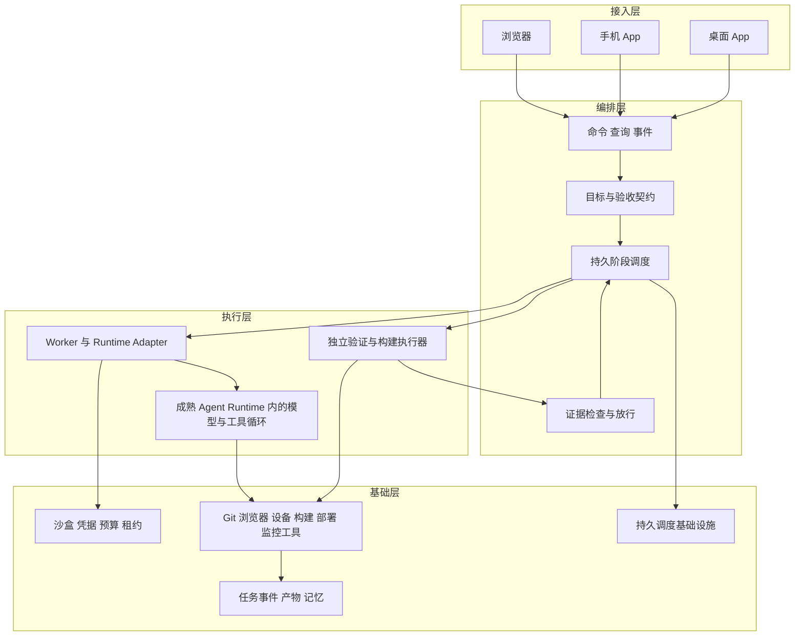

# Loopit 移动端自主研发工作台规格

版本：v0.3；日期：2026-10-08；状态：评审稿。

工作台的目标是：人给出目标与验收标准，系统在既定资源和权限范围内，自主完成需求整理、UI 与设计、开发、测试与验证、打包部署、运维观察；失败时自行诊断、修复和重试，最终交付可核验的结果。首个闭环必须落在现有 Loopit 移动端的真实小功能上。

核心设计采用四层：**接入、编排、执行、基础**。模型负责理解、判断和生成方案；harness 提供模型无法仅靠推理可靠完成的现实操作、持久状态、资源隔离、预算约束和证据核验。按用户已确认决定，采用 OpenCode 作为唯一开源主工程及 Agent 运行时，沿用其可用能力，新增代码集中在交付契约、Loopit 连接器及产品体验。四层是对底座职责的映射，不要求重建四套框架。

本版确认 OpenCode 单底座，撤回多执行器组合及 Claude Agent SDK 必接要求；数据库、调度器和客户端技术优先沿用底座。具体发行版、改造范围及能力实测由 M0 冻结，见[ADR-0001](decisions/0001-opencode-base.md)。

本文与[执行契约](execution-contracts.md)、[验收规格](acceptance-spec.md)、[参考与选型](reference-and-selection.md)共同构成实现依据。过往工程只提供经验和候选能力，不构成本项目必须沿用的架构决定。

## 1 产品目标与边界

### 1.1 用户只负责什么

用户负责目标、验收标准及其变更。项目首次接入时，用户同时确定这些标准的适用范围：目标仓库、允许的部署环境、预算、数据边界和发布条件；这些是可继承的 Project Policy，不需要逐工具、逐阶段重复确认。

正常交付链 MUST 不依赖人点击继续、搬运上下文、手动挑模型、手工跑测试、处理合并冲突、安装包或操作测试手机。符合已授权策略的动作自动执行。范围内的问题由模型和工具解决；确实缺少目标、验收定义或授权能力时，系统产生结构化约束请求，阻塞相关任务并继续其他独立任务。

“无人在执行回路中”不意味着必然成功。系统 MUST 能诚实结束为失败、预算耗尽或受外部约束阻塞；不得以等待人工操作代替已承诺的自动化能力，也不得将阻塞计为交付成功。

### 1.2 工作对象与首期范围

工作台服务于 Loopit 移动端研发，也支持日常编码助手场景。它有浏览器、手机 App、桌面 App 三种操控入口，执行发生在拥有仓库、凭据、构建链和设备的 Worker 上。操控入口与被测试的 Loopit App 是两个不同产品角色。

首期以单组织、小团队、一个控制平面、一个常驻 macOS Worker 为基线，承载 iOS 构建与设备能力，并可执行 Android 工具链。多租户 SaaS、任意项目自动迁移、所有桌面操作系统、本地模型训练、任意商店审核必然通过，均不属于首个闭环的承诺。

首个功能的交付终点建议设为：**内部测试渠道可安装的构建，指定设备通过验收，测试环境观察窗口通过**。生产灰度与公开商店发布在目标中明确要求后才成为该任务的完成条件；“上传成功”“提交审核”“商店批准”“用户可更新”是不同事实。

### 1.3 核心产品模型提案

建议以 **Project → Task → Run → Delivery** 为主线，Conversation 附属于 Task。该产品模型尚待用户确认；不阻塞下层契约设计。

| 对象 | 含义与所有权 |
| --- | --- |
| Project | 仓库、知识、环境、预算默认值、工具与运行策略的边界，可绑定多个仓库 |
| Task | 一个版本化目标及其验收契约；可以是研发、调查、审查、文档、运维或自我改进 |
| GoalRevision | 目标、范围、验收标准的不可变版本；只有用户的目标或标准变更可产生新版本 |
| Run | 为某个 GoalRevision 进行的一次交付尝试；包含计划、阶段、重试、执行环境与成本 |
| StageRun / Attempt | 一个研发环节及其执行尝试；失败重试不新增业务 Task 来清洗失败记录 |
| Candidate | 精确的代码或内容候选；记录提交、补丁、依赖与构建配置摘要 |
| Artifact / Evidence | 可寻址的产物及能支持具体结论的证据；摘要与原始数据分开保存 |
| Assessment / GateDecision | 模型的有依据评估 / 程序依照固定契约作出的放行结论 |
| Delivery | 已验证候选、构建、部署回执、验收报告与观察结果的聚合视图，不是第二份事实库 |
| RuntimeSession | 所选开源底座的原生会话引用；与业务 Task 或 Run 显式关联 |
| ImprovementProposal | 从运行经验产生的改进候选，绑定父目标、作用域与独立预算 |

产品模型的取舍：以会话为核心适合探索与问答，但会话结束无法证明功能已交付；以目标任务为核心更适合跨设备、跨天恢复和统计。优先扩展底座已有对象，保持一个权威业务状态；会话与交付目标的语义须能区分，不要求再建一套通用任务平台。日常“随便问一下”仍可创建轻量调查 Task，其验收产物是有来源的答复，不强制生成代码或安装包。

### 1.4 用户界面

| 页面 | 用户看见的重点 |
| --- | --- |
| 项目首页 | 目标队列、正在执行、交付结果、受约束任务、资源健康 |
| 新建目标 | 目标、输入附件、可观察的验收条目、继承的环境与预算；可由模型协助起草 |
| 任务详情 | 目标版本、当前阶段、事实时间线、剩余预算、验收条目与证据、对话 |
| 交付查看 | 代码差异、设计稿、设备录屏、构建下载、部署状态、失败与修复历史 |
| 运行详情 | 模型与 Runtime 版本、工具调用、上下文来源、日志、恢复记录、费用 |
| 后台面板 | 成功率、失败率、阻塞、无人交付率、耗时、成本、资源、改进实验 |

手机端 MUST 支持目标创建、材料上传、查看进度与证据、修改目标标准、取消任务及接收结果通知；桌面端增加本机接入、差异查看和调试便利；浏览器承担完整管理与后台面板。三端共享领域协议与连接状态逻辑，不强求原生组件完全同构。

## 2 不可破坏的设计原则

| 编号 | 原则 | 落地约束 |
| --- | --- | --- |
| R1 | 严格区分 model 与 harness | 推理由模型完成；权限、状态、预算和可验证事实由系统执行；不自研第二个编码循环 |
| R2 | 浏览器、手机 App、桌面 App 多入口 | 共用命令、查询、事件；入口断开不终止 Worker；原生手机 App 纳入 v1 验收 |
| R3 | 旧资产只供借鉴 | 以契约和实测决定复用，不预设原样搬运或保留历史数据模型 |
| R4 | 自主执行与自我迭代 | 任务内修复循环、运行后经验循环、工作台自身升级循环分别验收 |
| R5 | 人只定目标和验收 | 项目策略预先固定权限与预算；阶段放行自动化；统计所有人工执行触碰 |
| R6 | 四层架构 | 层是职责，不等于必须拆四个服务；源码依赖面向契约 |
| R7 | harness 五个关注面 | 工具、上下文、记忆、目标与验证 loop、沙盒都有明确所有者 |
| R8 | 复用成熟开源 | 采用已选定的 OpenCode 主工程及其 Agent 运行时；不拼多套 Agent 平台；锁版本、保留来源、做兼容性实测 |
| R9 | 产品模型明确可商量 | Task 与原生 Session 分离；主线模型提案、未定项显式记录 |
| R10 | 六环节固定输入输出且可短路 | Artifact 契约稳定；模型决定适合的执行路径；跳过需要有效证据 |
| R11 | 自有后台与准确统计 | 从持久化事实计算指标；Run、Task、阶段分别统计，不隐藏失败和阻塞 |
| R12 | 预留学习能力 | 轨迹、反馈、数据集、评测、技能版本、实验与模型注册接口独立 |

新增 harness 功能 MUST 回答：模型已能提出什么？系统还必须保证什么？是否有成熟实现可接入？如果只是把常见业务决策写成大量条件分支，应优先改为提供信息和工具，让模型决策。

## 3 四层架构

### 3.1 接入层

负责用户身份、目标输入、状态与证据展示、通知及平台适配。只持有投影缓存和客户端偏好，不拥有业务任务状态、执行锁、模型密钥或发布凭据。手机后台受操作系统挂起时，服务端继续执行，重新打开后按游标恢复。

所有变更命令携带 `commandId + expectedVersion`；重复发送返回同一命令回执，目标修改冲突返回明确的版本冲突。未连接时允许保存草稿，不显示为已提交。旧客户端不支持的能力必须禁用并说明，不能误发等价性未经验证的命令。

### 3.2 编排层

负责目标及验收版本、依赖图、阶段交接、预算、调度、事实持久化与放行。计划由模型提出，编排层验证计划合法性、数据依赖、能力匹配与预算；不根据业务关键词手写“遇到某页面就怎么做”。

沿用并扩展底座的权威业务状态与持久化机制，落实事务性事件、命令回执和恢复合同。先验证底座已有的跨阶段等待、计时、唤醒与恢复能力；缺口通过扩展或必要基础库补齐，不预设再引入 Temporal 或第二套调度平台。模型调用和外部 I/O 位于执行边界，恢复不重新生成已提交的计划，也不复制第二套业务“成功”定义。

### 3.3 执行层

所选底座的 Agent Runtime 负责单个工作单元内部的模型推理、工具循环、原生会话、上下文压缩与子代理能力。优先直接使用底座原生接口；需要时增加薄映射落实启动、事件、停止、恢复与产物合同，不建设通用多 Runtime 适配平台。

默认先串行跑 Builder 与 Verifier。需要并行时，每个写代码 Attempt 使用独立工作副本；同一设备同一时刻只有一个控制者。独立验证不要求固定十个常驻角色或多个模型厂商；要求独立会话、只读候选、受保护的验收契约及可追溯证据。模型审查提高覆盖面，但不是确定性真值。

### 3.4 基础层

负责数据库、内容寻址产物库、模型和工具连接、设备池、构建节点、OS 隔离、密钥代理、可观测性及备份恢复。优先使用成熟实现，不重新实现容器、浏览器驱动、Git、移动端操作系统控制和分布式计时器。

源码依赖规则映射到所选底座已有模块：接入使用应用契约；交付规则与具体客户端、模型供应商和设备驱动解耦；存储、调度和工具通过底座扩展点接入。优先保持上游目录与构建方式，不为满足抽象目录图而重写底座。

## 4 Model 与 harness 的责任边界

| 工作 | Model / Agent Runtime | 工作台 harness |
| --- | --- | --- |
| 理解需求、提出澄清项 | 生成问题、取舍与建议 | 提供目标版本与上下文；接收用户修订 |
| 规划和改计划 | 决定步骤、工具、并行与修复方案 | 检查依赖、权限、预算及产物类型；持久化决策 |
| 编码、UI 设计、诊断 | 阅读材料、修改候选、解释证据 | 提供沙盒、仓库、设备、构建与检索能力 |
| 事实采集 | 选择有意义的观察与实验 | 返回原始结果、时间、版本、来源与副作用回执 |
| 语义评估 | 对 UI、方案、原因给出有证据的评估 | 检查引用存在、绑定版本、规则是否满足；保留不确定性 |
| 验收 | 不可自行宣告整个任务成功 | 按冻结契约聚合必需结果；证据缺失或未知不可通过 |
| 记忆 | 提议保存、归纳、合并或淘汰经验 | 存储、检索、作用域、有效期、晋升和撤回 |
| 停止和恢复 | 可以提出停止、换策略或重试 | 终止进程、收回权限、核对外部状态和资源所有权 |

“只做模型做不到的东西”在工程上指：模型不能凭语言保证状态持久、执行互斥、权限隔离、成本封顶和事实真实，harness 必须落实这些保证。它不意味着系统里没有确定性的调度、合同检查或业务验收程序。

三个循环只有各自一个所有者：Runtime 管单次推理与工具循环；编排管跨阶段的目标与验证循环；改进管跨 Run 的经验与版本迭代。上层不重复逐 token 管理下层，也不在未知状态下替下层再次启动同一工作。

## 5 Harness 的五个关注面

### 5.1 工具

工具注册包含输入输出 schema、版本、能力、权限范围、副作用等级、超时、幂等性、取消和核对方法。统一结果至少区分 `succeeded / failed / indeterminate`，不能把网络超时等价为动作未发生。

优先采用原生公开 API、CLI、MCP 等可靠接口，必要时使用 UI 自动化。工具发现按需加载；不能一次将全部工具说明、原始日志和截图塞进模型上下文。工具返回值是数据，不得改变目标、权限或验收标准。

Shell 与内置文件工具也必须受 OS 沙盒约束；单独给 MCP 工具加权限而允许 Shell 绕过同一限制，不满足本规格。

### 5.2 上下文

每个 Attempt 有不可变 ContextManifest：目标与验收版本、仓库候选、工具能力、计划版本、项目知识引用、相关历史结果、策略版本及预算。随执行新增的信息追加为版本化引用。

项目知识按任务检索，先使用文件索引、结构索引与全文检索，确有召回收益再增加向量检索。原生会话压缩优先交给底座 Runtime；工作台保存关键事实和原始材料引用以支持同底座会话或 Worker 重建。压缩摘要不能覆盖源证据或成为唯一恢复依据。

原生会话丢失或迁移 Worker 时，使用目标、候选、当前计划、失败事实与有效产物，在同一底座重建执行；不要求跨 Runtime 迁移。全局个人配置不得未经声明进入自动执行环境；有效指令、skills 与权限配置都须进入 manifest，避免历史项目规则泄漏。

### 5.3 记忆

| 类型 | 保存内容 | 使用方式 |
| --- | --- | --- |
| 工作记忆 | 当前任务事实、待办、checkpoint | 随 Run 恢复，不跨项目默认共享 |
| 情景记忆 | 历次执行、失败原因、修复和证据 | 按相似问题检索，保留版本和来源 |
| 语义记忆 | 项目约定、领域知识、ADR | 按作用域与新鲜度检索，源文件优先 |
| 程序记忆 | 验证过的 skills 与工作方法 | 按需加载，附适用条件、反例与评测 |

MemoryEntry MUST 包含作用域、来源、版本、可信状态、有效期及撤回标记。模型产生的是候选记忆，独立评测或来源核验后才晋升。当前代码、设备状态和目标契约优先于历史记忆；冲突时展示冲突并重查事实。敏感值与凭据不进入记忆或训练集。

### 5.4 目标与验证 loop

标准循环为：目标冻结 → 计划 → 执行 → 采集当前候选证据 → 验证 → 未通过则诊断并修复 → 重验受影响部分 → 交付与观察。流程不依赖模型说“已经好了”。

Gate 将验收项分为可执行断言、测量阈值和模型语义评估。前两类由程序判定；第三类必须有预定义 rubric、对应当前产物的引用和合格的评估器，必要时多次评估。程序只能检查协议并聚合该类评估，不能声称消除了模型判断误差。

每次失败都记录 failure class、失败指纹和已尝试策略。同一失败在两次修复后没有新证据时，下一次必须引入新诊断或替代策略；总修复次数与成本仍由目标预算封顶。预算耗尽以真实失败结束，不能不断新建子任务逃避预算。

### 5.5 沙盒与资源

每个任务隔离工作目录、进程、网络、凭据和可写范围。Git worktree 只提供代码隔离，不是安全沙盒。Linux 可以采用容器或 VM；macOS 的构建和 iOS Worker 使用专用低权限账户、受控目录及独立的设备/签名代理，隔离强度写入能力声明。

设备和部署资源使用租约与 fencing token。设备命令必须经过同一个资源 Broker；历史 Panels、ADB 或其他 CLI 直连不受普通协作锁保护，应封闭旁路或将节点标为无法提供独占保证。旧 Worker 失联后不得仅凭租约超时就重复控制设备或部署。

构建、签名、验证和发布可以有不同权限。模型不接触签名密钥、发布 token 或完整个人主目录；密钥通过短期引用由代理在执行时解析。输入、日志与截图按敏感性处理，必要取证无法在隐私约束下完成时必须返回可解释的证据缺口。

## 6 日常能力覆盖

| 场景 | 工作台要求 | 交付物与验收 |
| --- | --- | --- |
| 代码问答、架构理解 | 仓库与符号检索、文件引用、持久会话 | 有代码依据的答复，可短路到报告交付 |
| 新功能、Bugfix、重构 | 仓库编辑、Shell、Git、隔离工作副本、失败修复 | 候选差异、适用测试与构建证据 |
| UI 与设计实现 | 图片/设计输入、交互状态、视觉验证、设备观察 | 版本化设计产物、实现截图与评估 |
| Review 与测试 | 独立审查、测试生成、静态检查、设备回归 | findings、复现及验证结果 |
| 浏览器任务 | 搜索、网页材料、页面操作与取证 | 可追溯网页或浏览器证据 |
| 文件与文档 | 文件附件、文档/数据工具及产物预览 | 有来源的文档、表格或分析产物 |
| 多任务与长任务 | 队列、并发隔离、持久化、暂停/取消/继续 | 可恢复的任务事实与资源占用 |
| 工具与插件 | MCP、CLI/API、skills、按需发现与能力探测 | 可安装、可回滚的版本及契约测试 |
| 移动端工程 | 安装、启动、UI、日志、网络、性能与构建身份 | 指定平台及设备上的真实证据 |
| 打包、部署、运维 | 构建/发布连接器、健康观察、异常诊断 | 安装包、部署回执、观察结果及恢复记录 |

v1 覆盖上述类别的代表性验收任务，不承诺复刻 Codex/Claude 的全部界面功能、全部插件或所有工具协议。语音、市场、任意桌面 GUI 操作可作为扩展；手机、桌面、浏览器三入口不是可延期删除的扩展项。

## 7 研发流程与短路

固定环节为 **需求 → UI/设计 → 开发 → 测试/验证 → 打包部署 → 运维**。环节描述交付合同，不要求每个目标都新跑全部六步。固定输入输出见[阶段契约](execution-contracts.md#3-六个环节的输入输出)。

模型生成有类型依赖的计划图。阶段可以因不适用而 `not_applicable`，也可以以完全匹配的已有产物 `reused`；二者都要留下原因、依据和适用的契约版本。依赖方必须得到合法输出或显式的不适用声明。不能把“没跑”记成通过。

例：纯文案修复可复用设计；纯调查不需要写仓库和构建；已有签名包可以直接进入发布验证；紧急回滚可直接进入部署与观察。UI 修改不能跳过要求的 UI 证据；新候选改变依赖摘要后必须使相关旧证据失效。

测试阶段可以创建用于设备运行的测试构建。正式打包阶段负责可分发产物与部署，优先构建一次、验证并发布同一二进制。最终包若改变构建配置、签名、环境、裁剪/混淆或 bundle，必须逐条重判证据适用性并重跑受影响验收；不能证明哪些条目不受影响时，重跑全部必需功能验收。绑定最终包的安装与冒烟只是最低要求。

## 8 稳定性与性能设计

### 8.1 持久与恢复

先记录意图再执行副作用。业务事件、投影、命令回执与 outbox 在同一事务提交；客户端的 accepted 只代表意图入账。任务被接受后，即使 UI、API 或 Worker 重启，任务身份和已提交事实也不得丢失。

外部调用使用 Operation Ledger，携带稳定逻辑操作 ID、幂等键和核对方法。回执丢失进入 `indeterminate` 并先核对事实；没有可靠核对能力时阻塞该副作用，保留其他可执行工作。分布式调度不能消除网络不确定性，不承诺所有外部动作恰好执行一次。

取消是独立生命周期：记录取消 → 停止新动作 → 请求 Runtime 停止 → 核对进程树及设备/部署状态 → 清理资源。收到取消 ACK 不能立刻写成已取消。启动恢复时先核对旧进程与外部作业，再安排重试。

### 8.2 性能

控制面不代理高带宽录屏和全部原始日志。事件流按 Task 订阅、支持游标、批量推送与背压；大产物通过受控对象读取。客户端虚拟化长列表，差异和日志按需加载。

模型调用通常占主延迟，应分别测量排队、上下文准备、首个 Runtime 事件、推理、工具、构建和验证耗时。热缓存按候选、依赖、工具链和策略版本命中；不缓存变化中的设备事实来伪装实时观察。构建缓存隔离不可信写入，正式构建验证完整性。

初始验收目标：命令受理 p95 ≤ 300 ms，任务详情查询 p95 ≤ 500 ms，事件提交到前台可见 p95 ≤ 1 s，热 Worker 调度 p95 ≤ 2 s。基准环境、负载与恢复目标见[验收规格](acceptance-spec.md)，这些数字不包含模型推理及外部构建等待。

### 8.3 可运维性

每个 Task/Run/Attempt/Operation 的 trace ID 可以贯穿控制面、Worker、模型请求、工具和验证。状态异常必须能定位至阶段、资源与失败类别；告警按同一故障聚合，恢复后自动解除。

数据库与产物分开备份，记录恢复点；每个里程碑执行一次备份恢复演练。凭据失效、磁盘满、设备离线、模型限流、签名失败、指标不可查询均有明确降级与终止行为，不能无限显示“进行中”。

## 9 自有后台与指标口径

后台提供总览、任务队列、运行详情、失败聚类、资源池、费用、验证质量、学习实验与版本管理。按项目、任务类型、平台、Runtime/模型版本、阶段、策略版本和时间窗口过滤。

以入队的 GoalRevision 作为稳定交付统计单位，Run/Attempt 单独统计。设同一入队 cohort 在截止时刻：S 成功、F 失败、B 阻塞、C 取消、U 尚未结案即被新目标取代、A 活跃、Q 排队、H 暂停；总数 N = S+F+B+C+U+A+Q+H。所有状态都必须可见。已成功、失败或取消的 revision 不因后续修订改成 U，只添加 successor 链接；目标修订不得把既有失败移出分母。

| 指标 | 定义 |
| --- | --- |
| 已结案成功率 | S / (S+F)，同时显示分子分母；分母为 0 则显示暂无数据 |
| 已结案失败率 | F / (S+F)；blocked、cancelled、superseded 单独展示 |
| 截止时交付率 | S / N，配套显示排队/活跃占比、任务龄和 deadline 达成率 |
| 无人交付率 | 成功且执行触碰为 0 的目标数 / N；目标与标准的初始设定不计执行触碰 |
| 首次通过率 | 首次完整验证即通过的目标数 / 已执行完整验证的目标数 |
| 自修复成功率 | 出现验证失败后最终通过的目标数 / 出现验证失败的目标数 |
| 误通过率 | 经复核或事故确认错误放行的结果数 / 已复核的放行结果数，显示抽检覆盖 |
| 运行效率 | 端到端与各阶段 p50/p95、模型/工具/等待时间、每成功目标成本 |
| 可靠性 | 重复副作用、失联、恢复时长、取消时长、证据缺失、资源泄漏 |
| 学习收益 | 同一任务集基线与候选的成功率、成本、耗时、错误记忆复用和回滚 |

人工手动修代码、跑命令、解锁设备、搬运产物、修改状态都计触碰；只读查看不计。目标中途修订产生新 GoalRevision，尚未结案的旧 revision 安全收敛后显示 superseded，已结案结果保持原值。Run 重试耗时和成本聚合回原目标，同时提供根 Task 跨 revision 的总成本、失败和修改次数。缺失费用显示未知，不能记作零。

## 10 自我迭代与机器学习接口

### 10.1 三种能力分开建设

1. **任务内自修复**：在同一目标和验收契约下，修正代码、配置或计划并重验；M1 必须实现。
2. **经验改进**：从轨迹提议记忆/skill/工具描述改进，通过固定评测再晋升；M2 提供最小闭环。
3. **工作台自我开发**：系统为自身创建有界改进 Task，在隔离副本构建候选版本，验证、灰度和回滚；M3 必须证明一次。

模型可在用户设定的长期改进目标下自动发现并创建子目标。每个子目标必须引用授权的父目标、预先确定的验收模板、预算份额与作用域；系统不能自行发明新的业务使命，也不能把未经授权的优化变成无限工作队列。

Hermes 的记忆与 skills 提供了可借鉴的经验学习方式；不能把这种方式写成基础模型在线更新权重。官方资料见[记忆](https://hermes-agent.nousresearch.com/docs/user-guide/features/memory)与[技能](https://hermes-agent.nousresearch.com/docs/user-guide/features/skills)。

### 10.2 改进发布

运行事实 → 有依据的复盘 → 候选改进 → 独立评测 → 小流量运行 → 指标检查 → 晋升或回滚。保留失败经验和反例；禁止只收集成功样本。训练/调参集与固定验收集隔离，按任务族或时间划分以降低泄漏。

Evaluator 的代码也可能有 Bug。允许系统在独立维护 Task 中提出并测试新版本，要求已知通过、已知失败、历史误判和隐藏反例；不能在当前失败任务里改低阈值后宣布原任务成功。目标契约语义、根权限策略及独立评测标准的变更仍属于用户制定标准。

工作台自身升级由独立的最小 Supervisor/Release Controller 执行。新版本不能直接覆盖正在控制它的进程；先启动候选、验证协议与历史数据兼容，旧 Run 固定旧 Worker 版本或显式迁移，再切流量。数据库采用向后兼容迁移；回滚不能删除已接受任务或恢复成无法读取新事件的版本。

### 10.3 预留接口

| 接口 | 最少内容 |
| --- | --- |
| TrajectoryExport | 可观察的输入、工具调用、结果、版本、成本、标签与脱敏策略；不依赖隐藏思维链 |
| FeedbackRecord | 客观验收结果、用户验收反馈、事故、纠错与来源 |
| DatasetSnapshot | 版本、来源、授权范围、去重、切分、删除与保留规则 |
| EvaluationRunner | 固定任务集、seed/环境、策略版本、指标、失败明细 |
| ExperimentRegistry | 基线/候选、样本量、资源预算、结果和晋升记录 |
| PolicyArtifact / ModelRegistry | skill/prompt/router/model 的可回滚版本及兼容能力 |

先用检索和技能改进证明收益，再评估排序、路由、提示优化、微调或强化学习。优化目标必须同时考虑成功、成本和误通过，不能单独奖励“任务被标记成功”。训练服务不得持有生产执行凭据。

## 11 技术基线与复用策略

技术基线由唯一开源底座决定，沿用其语言、客户端、连接协议、存储及 Agent 循环。撤回预先固定 TypeScript 控制服务、React Web、Electron、React Native 的组合；缺少手机 App 时，新增入口复用同一服务端与协议，仍须在 M2 完成手机 App 验收。

先验证底座原生存储与调度能否满足事件、幂等、恢复、证据和容量合同；不再把 PostgreSQL、Temporal 设为默认依赖。确有缺口时记录最小扩展及运维成本，不以换名字的方式另建完整控制平台。产物仍需摘要绑定与可靠存储；隔离与独立验证身份不因单底座而削弱。

M0–M3 使用一个开源主工程及其运行时，锁定版本后完成全链路验收。覆盖 Codex/Claude 日常场景是能力目标，不要求接入这两个产品。Claude Agent SDK/Claude Code 执行核心不作为必需依赖；后续需要某模型时可通过底座支持的官方模型 API 接入，模型服务授权与底座开源许可分开记录。

用户已确认采用 OpenCode；moremore 中的 Pi、DeepSeek Harness、T3 等仅保留参考，不并行接入。优先沿用 OpenCode 的现有产品和服务接口；手机 App、可靠恢复、隔离、完整自主交付等仍须实测或补齐，不能因选型确定就宣布能力已通过。后续若出现硬性阻碍，按 ADR-0001 记录证据并重新评估，不静默更换底座。

mobile-ui-runtime 的语义操作和证据协议、mobile-ui-case 的 case/oracle、loopit-panels 的观察体验优先做适配验证。是否直接依赖、提取协议、替换实现，由 M0 的契约实测决定。特别是旧 Runtime 的本地 ledger 最佳努力写入，不能直接充当要求事务性持久化的交付事实库。

完整候选、已知边界、版本快照与淘汰条件见[参考与选型](reference-and-selection.md)。

## 12 建设顺序

每个里程碑的具体输入、需求、实现切片与退出条件见[分阶段规格总览](milestones/README.md)。以下是阶段边界，细化规格不改变共同执行合同。

| 里程碑 | 可交付内容 | 必须证明的结果 |
| --- | --- | --- |
| [M0 契约与接入验证](milestones/m0-contracts-and-integration.md) | 冻结首个小功能、运行策略、Runtime/设备/构建探测、固定验收集、极简任务 API | 在真实工具链上可启动、停止、恢复、取证；已知好坏样本能区分；部署去重可核对 |
| [M1 一个功能自主交付](milestones/m1-autonomous-feature.md) | 最小 Web 控制页、持久任务与事件、一个 Runtime、设备 Broker、验证与内部发布连接器 | 真实 Loopit 小功能从目标到内部部署与观察，执行人工触碰为 0；故障后恢复，注入失败后自修复 |
| [M2 日常工作台 v1](milestones/m2-daily-workbench.md) | 同一底座的浏览器/手机 App/桌面 App、自有后台、日常能力、知识检索、最小技能晋升 | 三端一致控制、代表性日常任务、长会话与并发恢复、指标正确、记忆可撤回 |
| [M3 工作台自主迭代](milestones/m3-self-improvement.md) | 长期改进目标、自动子任务、隔离评测、候选发布与回滚、学习数据接口 | 自主为工作台实现一个功能并更新自身；负向候选被拒绝；升级失败自动回滚 |

M0 可以使用纯代码样例做协议测试，但不能据此宣称 M1 成功。M1 的一例成功证明链路存在；v1 稳定性需要固定评测集和连续运行统计。每个里程碑均产出新版本 spec、变更、测试结果、构建、部署和运维事实，工作台建设本身也遵守六环节契约。

首批实现切片依次为：目标/事件/产物协议 → Runtime 生命周期与沙盒 → 设备和构建身份 → 验证与修复循环 → 内部分发与观察 → 三端接入和后台 → 自我改进。每片必须有可独立验收的输入输出，前一片通过后才扩大基础设施范围。

## 13 已确认与待定决策

| 项目 | 当前状态 | 默认提案或影响 |
| --- | --- | --- |
| 首个闭环对象 | 用户已确认 | 现有 Loopit 移动端真实小功能 |
| 四层与五个 harness 关注面 | 用户要求，固定 | 按本文边界执行 |
| 人的角色 | 用户要求，固定 | 目标与验收；无例行阶段审批或人工执行步骤 |
| 核心产品模型 | 待用户反馈 | 项目、目标任务、执行、交付物为核心，会话为交互方式 |
| 首个具体功能 | 待用户设定目标与验收 | 验收文档提供可直接替换的功能样例，不视为已批准需求 |
| 首验平台与设备 | 待明确 | 建议先 Android 真机完成第一条链路；iOS 使用相同合同单独验收，不能以一端代替另一端 |
| 首个部署终点 | 待明确 | 内部测试渠道及测试环境观察；公开发布按目标另行纳入 |
| 单一开源底座 | 用户已确认 OpenCode | 沿用其主工程及 Agent 运行时；M0 锁定具体版本并验证，不依赖闭源 Agent 核心 |
| 技术组件 | 随底座验证后冻结 | 优先沿用底座实现，缺口做最小扩展；替换方案不削弱验收契约 |

设备类型、发布范围与预算可以随目标一次性设定。它们影响某次交付的验收配置，不改变工作台的多平台和自主交付方向。
